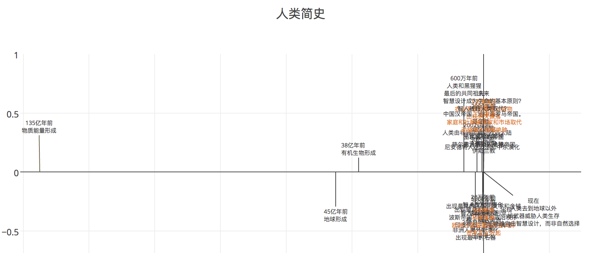

# 人类简史时间线

这时间线很尴尬啊…………因为135亿年对人类来说，太长。

## 时间线
[plotly 图](https://plot.ly/~mocoven/12/)

## 数据来源

[人类简史](https://www.amazon.cn/%E4%BA%BA%E7%B1%BB%E7%AE%80%E5%8F%B2-%E4%BB%8E%E5%8A%A8%E7%89%A9%E5%88%B0%E4%B8%8A%E5%B8%9D-Yuval-Noah-Harari/dp/B00T95D35G/ref=tmm_kin_swatch_0?_encoding=UTF8&qid=1491140982&sr=8-1)

## 为什么要弄这个？
因为我在学 Python 啊。

## 遇到的麻烦
在 plotly 上做图，如果有写中文在里面，导出代码时会遇到服务器错误，加这个试试看

	#!/usr/bin/env python
	# -*- coding: utf-8 -*-
